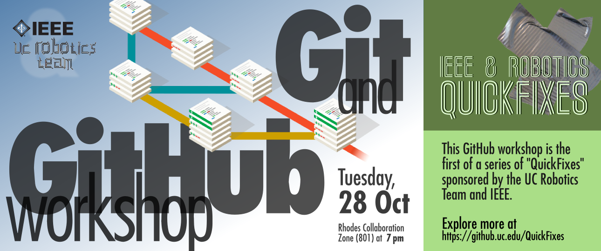

# Robotics+IEEE QuickFix #1

### Git and GitHub Workshop

This repository hosts reference materials and a sample repo for a hands-on Git/GitHub seminar.

Through the magic of Git, we've mirrored the course materials on GitHub.com for folks who can't login in through UC's CLS. Most project-specific links should include one link to the [github.uc.edu version](https://github.uc.edu/QuickFixes/just-gittin-started) (and one in parentheses for the [github.com version](https://github.com/QuickFixes/just-gittin-started)). If we've missed any of those, or if you notice any other kinds of brokenness, feel free to [file an issue](https://github.uc.edu/QuickFixes/just-gittin-started/issues) (on [github.com](https://github.com/QuickFixes/just-gittin-started/issues)) or [a pull request](https://github.uc.edu/QuickFixes/just-gittin-started/pulls) for the "origin" repository here at UC. `:)`

## Short URLs for this course

Here's the short link to get you back here:

  <a target="_blank" href="http://bit.ly/quickfix1home">
    http://bit.ly/quickfix1home</a>
  <a target="_blank" href="https://github.com/QuickFixes/just-gittin-started">
    
  </a>

<!--If you don't have a UC Central Login Service account,
click the octocat icons ()next
to each link for the GitHub.com versions instead.-->

Here are some other helpful links:

<table>
<thead>
  <tr><th width="40%">URL</th><th>What?</th><tr>
</thead>
<tbody>
  <tr>
    <td><a target="_blank" href="http://bit.ly/quickfix1chat">
      bit.ly/quickfix1chat</a></td>
    <td><small>If we get a big turnout and there aren't enough
      facilitators for every room, we'll be monitoring this Gitter.im
      chat room for questions. <em>Requires a GitHub.com
      account.</em></td>
  </tr>

  <tr>
    <td>
      <a target="_blank" href="http://bit.ly/quickfix1faq"
        title="FAQ article on github.uc.edu">
        bit.ly/quickfix1faq</a>
      <a target="_blank"
        href="https://github.com/QuickFixes/just-gittin-started/wiki/Frequently-Asked-Questions"
        title="FAQ article on github.com">
        </a>
    </td>
    <td><small>A list of what we predict might be Freqently Asked
      Questions, on the workshop's wiki. Pull requests
      welcome!</td>
  </tr>

  <tr>
    <td>
      <a target="_blank" href="http://bit.ly/quickfix1wiki"
        title="FAQ article on github.uc.edu">
        bit.ly/quickfix1wiki</a>
      <a target="_blank" href="https://github.com/QuickFixes/just-gittin-started/wiki"
        title="FAQ article on github.com">
        </a>
    </td>
    <td><small>The workshop's GitHub project wiki. The
      step-by-step tutorials we'll be going through in the workshop
      are here.</small></td>
  </tr>
</tbody>
</table>

## Giving feedback
One of the best ways to communicate with us about this workshop is to [file an issue](https://github.uc.edu/QuickFixes/just-gittin-started/issues), right here on the project page, even if it's just to complain about something. Even if it's just to experiment with how to file an issue! **We're all learning here**: you, how to do Git stuff, us, how to do Git stuff and _also_ how to teach Git stuff.

If there's something wrong with the course materials, or you have an idea for improvement, you can [file a pull request](https://help.github.com/articles/creating-a-pull-request/). We'd prefer all the issues and requests stay here on github.uc.edu so they're all in once place, but if you get mixed up and create them on the [GitHub.com](https://github.com/QuickFixes/just-gittin-started/) copy of this repository, that's all right. We get email notifications either way.

The workshop's [wiki][qfwiki] ([on github.com][qfgithubwiki]) is editable by anyone. **No need to ask permission to fix things there!**

While the workshop is going on, you can also hit us up on the [Gitter chat room](https://gitter.im/QuickFixes/just-gittin-started): to ask for help because we're in another room, or just to kvetch about something. This requires a [GitHub.com](https://github.com) account to sign in, but that's it. We'll also be intermittently monitoring Twitter for #[GitHubQuickFix](https://twitter.com/search?f=realtime&q=%23githubquickfix), if that's your thing.

## What you'll need to get started

### [tl;dr](http://www.urbandictionary.com/define.php?term=TLDR) version
0. The [slides for this course][slides] ([on github.com][githubslides]), if you're not physically attending and just want an overview of what's going on.
1. A [GitHub.com](https://github.com) account if you want to use the [chat room for the workshop](https://gitter.im/QuickFixes/just-gittin-started). You don't need to sign up for any accounts to use this repository on github.uc.edu, though. _That_ uses your regular UC CLS (six+two) login.
2. [GitHub Help](https://help.github.com), or your trusty googles if you get stuck. You can also have a look at our [references page][qfrefs] ([on github.com][qfgithubrefs]).
3. Software

    **No-install option**: Go to [try.github.io][trygit]. Yup. That's it. All in the browser.

    Otherwise:

    1. [Sublime Text](http://www.sublimetext.com/) (cross-platform, free to try)
    2. the official GitHub client for your platform ([Mac](http://mac.github.com), [Windows](http://windows.github.com))
    3. On Linux: `<your package manager's install command> git-core` plus [`git-cola`](http://pkgs.org/search/git-cola) (KDE) or [`giggle`](http://pkgs.org/search/giggle) (Unity/GNOME/XFCE) if you want something a bit nicer than `gitk` for visualizing your source tree.

4. Get your learn on
    * Command-line based tutorial: [gitimmersion.com](http://gitimmersion.com)
    * Walkthrough using the GitHub GUI to manage an HTML+CSS project (a simple web site): [github.uc.edu/QuickFixes/qf1-dancemoves](https://github.uc.edu/QuickFixes/qf1-dancemoves)

### Longer explanation
We know that not everyone at our workshop will be eager to dive into a [Unix shell](https://ucfilespace.uc.edu/wiki/search/Unix%20Access%20on%20UCFileSpace) and start using [Vim](http://vim.org) and console `git` commands. So out of consideration for folks without much command-line experience, and for consistency, we'd like everyone to install [Sublime Text](http://sublimetext.com) the official GitHub [GUI](http://windows.github.com) [clients](http://mac.github.com) **before coming to the seminar**.

These are straightforward, one-double-click installs for Mac and Windows.

*  Sublime Text is available for all three major OSes (not Amiga, sorry), has good out-of-the box keybindings and syntax highlighting, and pretty good Git integration [with a plugin](https://github.com/kemayo/sublime-text-git) (for more advanced users).
* The official GitHub client for Windows includes a self-contained installation of the Git command-line tools, and a colorized Powershell Git environment, which saves you the effort of installing msysGit or some other distribution. (Recent versions of Mac OS X already have `git` installed, and Terminal.app should be somewhere in your "Applications" folder.)

All that being said, if you're comfortable using some other text editor (that is _not_ Microsoft Word, sorry) and/or prefer to do all your Git stuff from the command line, that's just fine. Just realize that we simply won't have time to work out installation issues if you stray too far off the path.

##Resources on the Web

_The [References][qfrefs] ([on github.com][qfgithubrefs]) article in this project's wiki is **very** comprehensive, and already includes most of the resources listed below. It's organized by skill level, so you can tell at a glance which ones are useful to you._

### References
1. [Documentation on git-scm.com](http://git-scm.com/doc) - online help, videos, and ebooks, straight from the source
2. [GitHub Help](https://help.github.com/) - comprehensive online help that covers Git _and_ GitHub topics
3. [git ready](http://gitready.com/) - cookbook-style help for Git, when you already sort of know what you're trying to do but maybe don't know the precise Git nomenclature for it
4. [Mastering Markdown](https://guides.github.com/features/mastering-markdown/) - on GitHub.com; Markdown is the markup language used in GitHub issues, comments, and the default `README.md` for new repositories
5. [Highest voted questions tagged 'git' on Stack Overflow](http://stackoverflow.com/questions/tagged/git?sort=votes&pageSize=15)

### Videos
1. [Webcast • The Basics of Git and GitHub • July 2013](https://www.youtube.com/watch?v=U8GBXvdmHT4) - a 50-minute webcast hosted by a GitHub employee that provides a high-level overview of what Git is, why you'd want to use it, and how GitHub.com layers extra collaborative features on top of Git <abbr title="Source Code Management">SCM</abbr>.
2. [GitHub Training & Guides](https://www.youtube.com/channel/UCP7RrmoueENv9TZts3HXXtw) YouTube channel (check out their [video intro](https://www.youtube.com/watch?v=y04-NzarItQ) for a quick chuckle)
3. [GitHub Guides: GitHub & Git Foundations](https://www.youtube.com/playlist?list=PLg7s6cbtAD15G8lNyoaYDuKZSKyJrgwB-) - bite-sized videos covering one Git or GitHub topic each (_e.g._, `git diff`, `git rm`, branch, checkout, and merge) 
4. [Jessica Kerr: "Git Happens"](https://www.youtube.com/watch?v=Dv8I_kfrFWw) - a 54-minute conference talk which explains Git concepts like branching, merging, and rebasing in a highly visual way. Good if you're compfortable with basic Git usage, but have always wondered about more advanced usage like branching and rebasing. If you stick with it until the end, you'll be rewarded with an epiphany about `git rebase -i`. Promise.
5. [Michael Schwern: "Git for Ages 4 and Up"](https://www.youtube.com/watch?v=1ffBJ4sVUb4) - a demonstration of advanced Git functions (branch, merge, rebase) using Tinker Toys. Over an hour long, but totally worth it for the epiphanies you'll have about HEAD, tags, branching, and merging, if you didn't really "get" those concepts before.

### Tutorials
If you want a brief hands-on introduction to command-line Git with not much time commitment, there's [try.github.io][trygit], in the hallowed tradition of [_why the lucky stiff](http://vimeo.com/5047563)'s [Try Ruby](http://tryruby.org/).

I highly recommend Git Immersion (created by locals at [Neo](http://neo.com)) when you're ready to gain a deeper understanding of command-line Git. Git Immersion is structured into a bunch of separate exercises, with no requirement to start at the beginning if you know a lot of Git stuff already. You can use UCFileSpace for [shell access](https://ucfilespace.uc.edu/wiki/search/Unix%20Access%20on%20UCFileSpace) and UC's [GitHub Enterprise server](https://github.uc.edu) as the remote "origin" repository, if you wish.

* [Git Immersion](http://gitimmersion.com/)

Neo's tutorial helps you install Git on your workstation (but you can [use UCFS for that][ucfsquickfix]; [on github.com][ucfsgithub]), gets you up-and-running with a sane Git configuration, walks you through all of the common commit/push/merge operations, and even forces you to break (and fix) things in some of the advanced lessons. Each lesson is short, and easy to go back and reference later when you run into trouble on a _real_ project. Although the tutorial's sample project is comprised of Ruby code, no familiarity with the [Ruby language](http://ruby-lang.org) is actually required to complete the tutorial.

## Where to next?
Check out the ["When you're ready to learn more"](https://github.uc.edu/QuickFixes/just-gittin-started/wiki/References#when-youre-ready-to-learn-more) ([on github.com](https://github.com/QuickFixes/just-gittin-started/wiki/References#when-youre-ready-to-learn-more)) section of this workshop's wiki.

"Think Like (a) Git" and the "Advanced Git: Graphs, Hashes, and Compression" YouTube video are pretty satisfying resources when feel like you've got the basics and you're ready to learn more about Git internals.

<!-- footnote-style hyperlinks -->
[slides]: https://github.uc.edu/pages/QuickFixes/just-gittin-started/
[githubslides]: http://quickfixes.github.io/just-gittin-started/
[trygit]: https://try.github.io
[qfwiki]: https://github.uc.edu/QuickFixes/just-gittin-started/wiki
[qfgithubwiki]: https://github.com/QuickFixes/just-gittin-started/wiki
[githubhelp]: https://help.github.com
[qfrefs]: https://github.uc.edu/QuickFixes/just-gittin-started/wiki/References
[qfgithubrefs]: https://github.com/QuickFixes/just-gittin-started/wiki/References
[ucfsquickfix]: https://github.uc.edu/QuickFixes/lost-in-ucfilespace
[ucfsgithub]: https://github.com/QuickFixes/lost-in-ucfilespace
